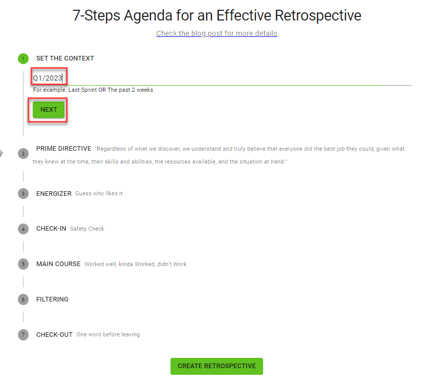

# Fun Retrospectives

The content of this first post has been migrated from an older blog of mine which I have discontinued. The original article was written two years ago when we had to prepare our first distributed/online retrospectives during the Corona lockdown. It describes my experience with [Fun Retrospectives](https://www.funretrospectives.com/), a book, website and very helpful online retro tool.

## Introduction

For those who do not know the term “retrospective” (or “retro” for short), I cite the following method-independent definition:

> Another agile practice is the retrospective, in which a team having finished a development iteration takes time off further development
> to reflect on the experience and the lessons learned, with the goal of improving its development process.
>
> –-- [Bertrand Meyer](https://bertrandmeyer.com/): [Agile! The Good, the Hype and the Ugly](https://bertrandmeyer.com/2014/06/02/accurately-analyzing-agility/), pg. 9

Retrospectives are an important agile practice. They facilitate the team’s self-organization and continuous improvement.

The concept was of course not invented by the agile movement. When I started my career in the software industry more than twenty years ago, we used to have a “touch-down” meeting at the end of every project, as we used to have a “kick-off” meeting at the beginning of every project. In other settings, these touch-downs were simply called “lessons-learnt”. And even in the Swiss Army, where I served in the last century, trainings used to be closed with a “debriefing” (or in German: “Manöverkritik”).

The achievement of the agile movement lies in the importance and value it has given to retrospectives. Scrum development teams do a retro after every sprint, which usually means every 2 to 4 weeks.

There are many books on the theory, philosophy and psychology of retrospectives. Far out at the practical end of the spectrum, there is Fun Retrospectives by Paulo Caroli and Tainã Caetano, a book and website which contain a wealth of techniques and activities to “break the ice” in a retro, to get the conversation going and to help uncover the real, hidden issues which bother the team members. Again, the general idea is of course not new: Good moderators have known such games and activities in pre-agile times. But the book is a good starting point for the novice and a great source of inspiration even for the experienced scrum master.

These types of activities were developed for in-person meetings, as agile methods in general were developed for personal interaction, with developers sharing (depending on the method) one room, one desk, one keyboard or even one lunchbox. But some of the activities can easily be performed in a distributed setting. And, fortunately, the authors have built an online tool where they have implemented a few of them. They have, in fact, implemented their full 7-Step Agenda for Effective Retrospectives.

Let’s look at how to successfully prepare and execute such an online retrospective.

## Preparation

To prepare a retrospective for your team, just create a [new agenda](https://app.funretrospectives.com/new) and configure the seven steps:

### 1. CONTEXT

Set the context for the meeting, for example “last sprint” or “last delivery” or “last week’s major incident”. This will align the participants’ expectations as to the scope of the retro. As we are nearing the end of the first quarter, we’ll set the context to “Q1/2023” in the example:

